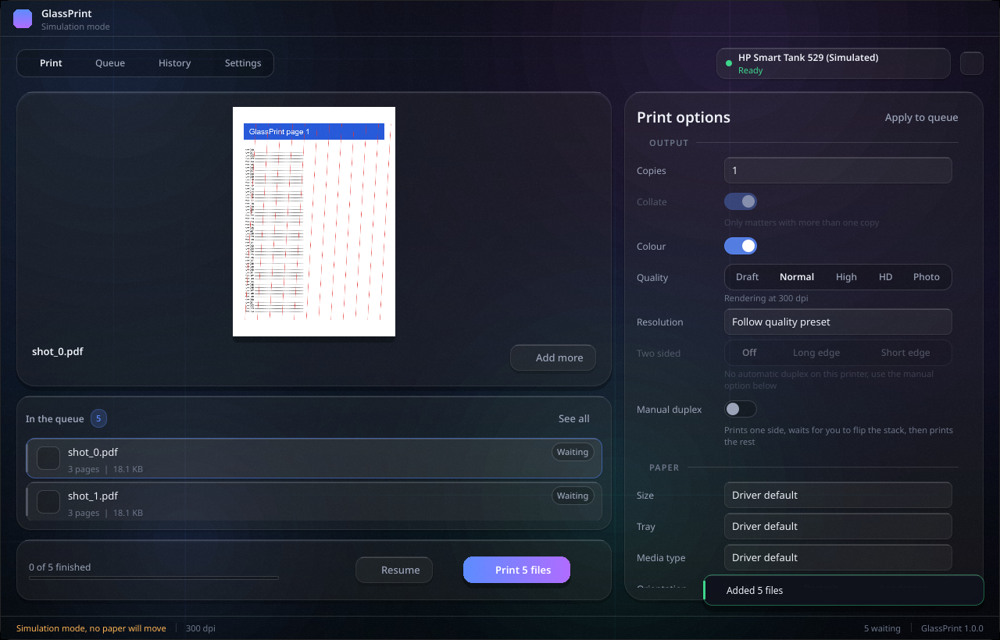
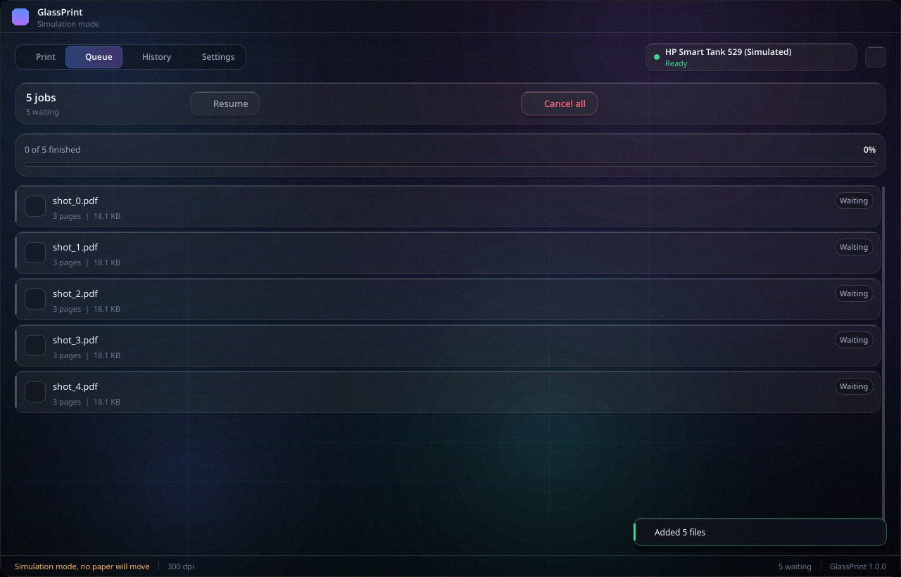
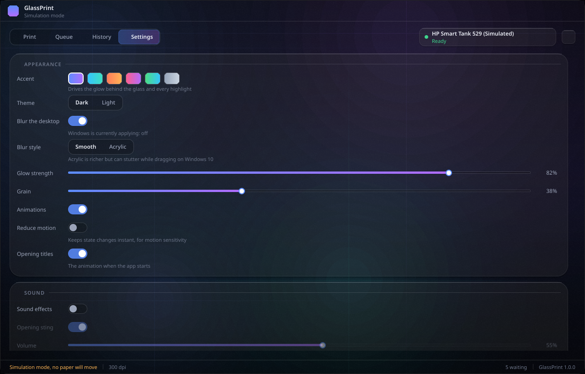

# GlassPrint

A printing companion for Windows 10. Drop files on it, choose how they should
print, press one button. Built for batches: hundreds of files at a time, one
device at a time, in order, with everything recoverable if it goes wrong.

The interface is frameless translucent glass over a drifting colour field, with
a title sequence on launch and sound throughout.



> The screenshots below were captured on Linux, where Segoe UI and Segoe MDL2
> Assets do not exist. Icons appear as empty boxes and text uses a fallback face.
> On Windows both are present and the interface renders as designed.

| | |
| --- | --- |
|  |  |

---

## What it does

**Printing**

- PDF, PNG, JPEG, BMP, GIF, WebP, TIFF (multi page), plain text and source code.
  Word, Excel and PowerPoint are handed to the application that owns them.
- Renders at the printer's real resolution, up to whatever it advertises. The HD
  preset asks the driver for its maximum, which on an HP Smart Tank 529 is
  1200 dpi.
- Copies, collate, colour or mono, paper size, tray, media type, orientation,
  automatic duplex where the driver has it, and **manual two sided** where it
  does not: one pass, a prompt to flip the stack, then the other pass.
- Fit, fill, actual size or a custom percentage. Full bleed. Extra margin.
  Auto rotate. Sharpening for enlarged scans.
- Page ranges (`1-5`, `2,4,9`, `7-`), odd or even only, reverse order.
- 2, 4, 6, 9 or 16 pages per sheet.
- A test page with registration marks, a millimetre ruler, grey and colour ramps
  and a line width ladder, for checking alignment and ink.
- Anything not covered above is reachable through **Printer settings**, which
  opens the driver's own property sheet. What you choose there is applied to
  GlassPrint's jobs.

**Batches**

- Drop folders and they are walked, filtered and natural sorted, so `scan_2`
  comes before `scan_10`.
- Pause between jobs, cancel one or cancel everything, reorder what is waiting,
  retry what failed.
- A failure never stops the run. Bad files are recorded and the batch continues.
- The queue is written to disk as it changes, so a crash or a power cut does not
  lose a four hundred file list.
- Live progress per file and across the batch, with an estimate that settles
  instead of swinging.

**After the fact**

- Every job is kept in a searchable history with the settings it used, and one
  click prints it again exactly the same way.
- Printer state is polled, so out of paper, paused, offline or ink low shows up
  without asking.
- Pause, resume or purge the Windows queue for the device from inside the app.

---

## Getting it

Download from the **Actions** tab of this repository, or from a release:

| Artifact | What it is |
| --- | --- |
| `GlassPrint-installer` | Installer. Per user by default, no administrator prompt. Recommended. |
| `GlassPrint-portable` | A single exe. Nothing to install, but slower to start because it unpacks itself each time. |
| `GlassPrint-folder` | The unpacked application folder, if you would rather copy it yourself. |

**Windows will warn you the first time.** The exe is not code signed, so
SmartScreen shows "Windows protected your PC". Choose *More info* then *Run
anyway*. Signing needs a certificate tied to a legal identity; if you want the
warning gone, that is the only route.

Requirements: Windows 10 version 1809 or newer, 64 bit. That floor comes from
Qt 6 itself.

---

## Running from source

```bash
git clone <this repository>
cd glassprint
python -m venv .venv
.venv\Scripts\activate            # Linux and macOS: source .venv/bin/activate
pip install -r requirements.txt
python tools/gen_assets.py        # sounds, grain and icon are generated, not committed as art
python app/main.py
```

Python 3.9 or newer. On Windows `pywin32` installs with the requirements and the
real printing stack is used. Anywhere else the app runs against a **simulation
backend**: three invented printers, full interface, no paper. Set
`GLASSPRINT_SIMULATE=1` to force that on Windows too, and `GLASSPRINT_DUMP=1`
to have every simulated page written out as a PNG under
`%APPDATA%\GlassPrint\cache\simprint` so you can see exactly what would have
been printed.

### Building the exe

```bash
pip install pyinstaller
pyinstaller build/glassprint.spec --noconfirm      # folder build, in dist/GlassPrint
set GLASSPRINT_ONEFILE=1
pyinstaller build/glassprint.spec --noconfirm      # portable single exe
iscc build\installer.iss                           # installer, needs Inno Setup 6
```

`.github/workflows/build.yml` does all of that on a Windows runner and uploads
the results.

---

## Checking it works

Five suites, all runnable without a printer:

```bash
python tools/verify_render.py     # rasterisation and placement, 35 checks
python tools/verify_engine.py     # whole jobs end to end, 38 checks
python tools/verify_queue.py      # batching, pause, cancel, retry, persistence, 22 checks
python tools/verify_ui.py         # loads the interface, fails on any QML warning
python app/main.py --selftest     # renders a real PDF and exits; run against the packaged exe too
```

`verify_render.py` is the one that matters for output quality. It asserts that a
page assembled from strips is byte identical to the same page rendered whole,
that content lands where the options say including the hardware margin, and that
"actual size" really is actual size. `--selftest` is run against the packaged exe
in CI, which is how a missing Qt plugin or asset gets caught before you see it.

There is also `tools/screenshot.py`, which renders the interface offscreen to
PNG. Useful on a machine with no display, though Segoe UI and Segoe MDL2 Assets
only exist on Windows, so elsewhere the text falls back and icons come out as
empty boxes.

---

## How it is put together

```
app/
  main.py                 entry point, Qt setup, --selftest
  bridge.py               the single object QML talks to, exposed as `App`
  models.py               list models behind the queue and history views
  core/
    printers.py           backend facade, capability cache
    printers_win.py       win32: spooler, DEVMODE, device contexts, driver dialog
    printers_sim.py       simulation backend, same API member for member
    options.py            the print option model and what constrains it
    geometry.py           page measurements in device dots
    printing/
      engine.py           runs a job: pages, sheets, copies, passes, progress
      sources.py          PDF and image page sources, strip rendering
      raster.py           placement maths and strip planning
      nup.py              pages per sheet
      textprint.py        text pagination, drawn with printer fonts
    jobrunner.py          the queue and its worker thread
    history.py            SQLite history
    settings.py           JSON settings
    sounds.py             sound effects
    win_effects.py        blur behind, dark title bar, rounded corners
    testpage.py           test page generator
  ui/qml/
    Main.qml              the window
    Glass/                the design system and every view
tools/                    asset generation and the verification suites
build/                    PyInstaller spec, version resource, installer script
```

A few decisions worth knowing about, because they are not obvious and they were
each arrived at the hard way:

**Strips, not pages.** A4 at 1200 dpi is 9921 x 14031 dots, which is 398 MiB as
a bitmap. Pages are therefore rendered and sent in horizontal strips inside a
48 MiB budget. PDF pages are rasterised once per page and strips are cut from
that, because asking QtPdf for each strip directly through `scaledClipRect` was
measured to drift its rendering scale by about 0.2 percent with the clip offset,
which walks content down the page and leaves a step at every strip boundary.

**Placement is relative to the printable area.** A Windows printer device
context puts its origin at the top left of the printable area, not of the sheet.
Full bleed output therefore deliberately draws at negative coordinates. Getting
this wrong is the usual reason output drifts down and to the right.

**Transparent PDFs.** QtPdf returns pages as ARGB with everything the document
did not paint left fully transparent. Dropping that alpha turns the background
of most real PDFs into solid black, so pages are composited onto white first.
There is a regression test for exactly this.

**No shader effects.** The soft colour fields behind the glass are stacked low
alpha discs rather than a blurred layer. A `MultiEffect` blur was tried first and
rendered nothing at all offscreen, and a background that can silently vanish on
some driver is not a good trade for an effect that geometry expresses exactly.

**Cancellation is per job.** There is no global "cancel everything" flag,
because such a flag has to be cleared again at precisely the right moment and
getting that wrong silently cancels work queued afterwards. Which it did, once.

---

## Licence

MIT. The sound effects, grain texture and icon are generated by
`tools/gen_assets.py`, so there is no third party artwork in here.
